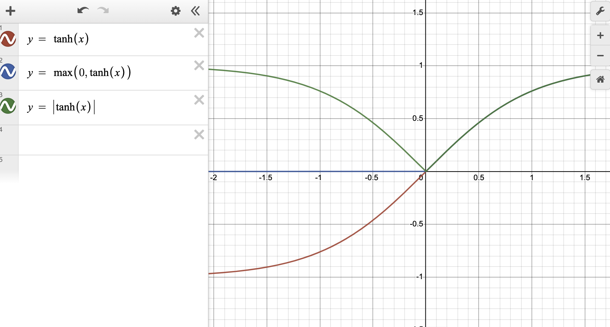

[toc]


# AlexNet 论文记录和代码复现


## ~~Introduction~~

~~高分辨率大尺度图片，当图片设置表现出相当大的可变性的时候，为了学习识别出千百个物体，我们需要一个构建一个较大的模型，但是物体识别中的巨大不确定性，~~


## The Dataset

ImageNet包含可变分辨率的图片，但是模型的输入是固定维度的，所以统一下采样规定图片尺度为256x256，除了从每个像素中减去训练集上的平均活动，我们还在raw RGB上训练


## The Architeture

model = 8 * learning layers 

learning layers = 5Conv + 3Dense


## ReLU Nonlinearity

在随机梯度下降下，relu作为<u>饱和非线性</u>明显比<u>非饱和非线性</u>训练速度慢。

`y= tanh(x)`

所以在训练中，使用ReLUs 

`y = max(0,tanh(x))`




> 另外介绍了一个激活函数**<u>持续非线性</u>**，在平均池化层，防止过拟合。不适用拟合数据的学习能力。
>
> `y= |tanh(x)|`


## Local Response Normalization

>  本地归一化响应

局部标准化有助于泛化。

内核映射顺序当然是任意的，并且在训练开始之前，就已经确定了。借鉴于实际的神经网络中横向抑制。


## Overlapping pooling

在常见的cnn中，邻居神经元通过相邻池单元进行累加指导没有重叠。

观察到，在训练过程中，有重叠汇集的模型發現過擬合稍微困難一些。


## Overall Arichiteture 

模型使用多项逻辑斯蒂回归。

> The first convolutional layer filters the 224×224×3 input image with 96 kernels of size 11×11×3 with a stride of 4 pixels (this is the distance between the receptive field centers of neighboring neurons in a kernel map). The second convolutional layer takes as input the (response-normalized and pooled) output of the first convolutional layer and filters it with 256 kernels of size 5 × 5 × 48. The third, fourth, and fifth convolutional layers are connected to one another without any intervening pooling or normalization layers. The third convolutional layer has 384 kernels of size 3 × 3 × 256 connected to the (normalized, pooled) outputs of the second convolutional layer. The fourth convolutional layer has 384 kernels of size 3 × 3 × 192 , and the fifth convolutional layer has 256 kernels of size 3 × 3 × 192. The fully-connected layers have 4096 neurons each.

1. `11x11x3,strides=4`

2. `5x5x48`

3. `3x3x256`

4. `3x3x192`

5. `256x3x3x142`

   

## Reducing Overfitting 


### data augmentation

cpu 上产生新图片，gpu用来训练模型

1. 平移和水平反射
2. 改变RGB通道强度

### dropout 

减少神经元的复杂协同适应，因为一个神经元不能依靠特定神经元存在。


# 代码复现

> 主要参考
>
> - https://www.kaggle.com/code/blurredmachine/alexnet-architecture-a-complete-guide/notebook
>
> - https://towardsdatascience.com/implementing-alexnet-cnn-architecture-using-tensorflow-2-0-and-keras-2113e090ad98
>
>   

```python
import  tensorflow as tf
from  tensorflow import keras
import  matplotlib.pyplot as plt
import  os
import time
from keras.datasets import cifar10
from keras.models import Sequential
from keras.layers import  Conv2D,Dense,BatchNormalization,MaxPooling2D,Flatten,Dropout

'''Dataset:CIFAR-10 dataset'''
# load dataset
(train_images,train_labels),(test_images,test_labels) =cifar10.load_data()
# label names
CLASS_NAMES = ['airplane', 'automobile', 'bird', 'cat', 'deer', 'dog', 'frog', 'horse', 'ship', 'truck']
# set up the train/val datasets (a small version)
validation_images,validation_labels = train_images[:5000],train_labels[:5000]
train_images,train_labels = train_images[5000:],train_labels[5000:]

test_images,test_labels = train_labels[5000:10000],train_labels[5000:10000]# add for model evaluation

# convert image to np.array
train_ds = tf.data.Dataset.from_tensor_slices((train_images,train_labels))
val_ds = tf.data.Dataset.from_tensor_slices((validation_images,validation_labels))
test_ds = tf.data.Dataset.from_tensor_slices((test_images,test_labels))# add for model evaluation

'''preporcessing image--data augmentation'''
def process_images(image,label):
    # normalize images to have a mean of 0 and standred deviation of 1
    image = tf.image.per_image_standardization(image)
    # resize
    image = tf.image.resize(image,(256,256))
    return image,label

'''Input Pipeline'''
train_ds_size = tf.data.experimental.cardinality(train_ds).numpy()
val_ds_size = tf.data.experimental.cardinality(val_ds).numpy()

train_ds = (train_ds.map(process_images)
                    .shuffle(buffer_size=train_ds_size)
                    .batch(batch_size=32,drop_remainder=True))
val_ds = (val_ds.map(process_images)
                .shuffle(buffer_size=train_ds_size)
                .batch(batch_size=32,drop_remainder=True))

# add for model evaluation
test_ds = (test_ds.map(process_images)
                .shuffle(buffer_size=train_ds_size)
                .batch(batch_size=32,drop_remainder=True))

'''AlexNet model'''
model = Sequential()
model.add(Conv2D(filters=96,kernel_size=11,strides=4,activation='relu',input_shape=(256,256,3)))
model.add(MaxPooling2D(pool_size=(3,3),strides=1))

model.add(Conv2D(filters=256,kernel_size=5,strides=1,activation='relu',padding='same'))
model.add(MaxPooling2D(pool_size=(3,3),strides=1))

model.add(Conv2D(filters=384,kernel_size=3,strides=1,activation='relu',padding='same'))

model.add(Conv2D(filters=256,kernel_size=3,strides=1,activation='relu',padding='same'))
model.add(MaxPooling2D())
model.add(Flatten())

model.add(Dense(4096,activation='relu'))
model.add(Dropout(0.5))
model.add(Dense(4096,activation='relu'))
model.add(Dropout(0.5))
model.add(Dense(len(CLASS_NAMES),activation='softmax'))
model.compile(optimizer='sgd',loss='mse',metrics=['accuracy'])
model.summary()

history = model.fit(train_ds,
          epochs=50,
          validation_data=val_ds,
          validation_freq=1,
          )

# summarize history for accuracy
plt.plot(history.history['val_accuracy'])
plt.title('model accuracy')
plt.ylabel('accuracy')
plt.xlabel('epoch')
plt.legend(['Pretrained'], loc='upper left')
plt.show()
# summarize history for loss
plt.plot(history.history['val_loss'])
plt.title('model loss')
plt.ylabel('loss')
plt.xlabel('epoch')
plt.legend(['Pretrained'], loc='upper left')
plt.show()
# history accuracy
print(history.history['accuracy'][-1])

# model evaluation
model.evaluate(test_ds)
```


# 引用

- [ImageNet Classification with Deep Convolutional Neural Networks](https://proceedings.neurips.cc/paper/2012/file/c399862d3b9d6b76c8436e924a68c45b-Paper.pdf)

- https://www.kaggle.com/code/blurredmachine/alexnet-architecture-a-complete-guide/notebook

- https://towardsdatascience.com/implementing-alexnet-cnn-architecture-using-tensorflow-2-0-and-keras-2113e090ad98
- https://www.desmos.com/calculator 