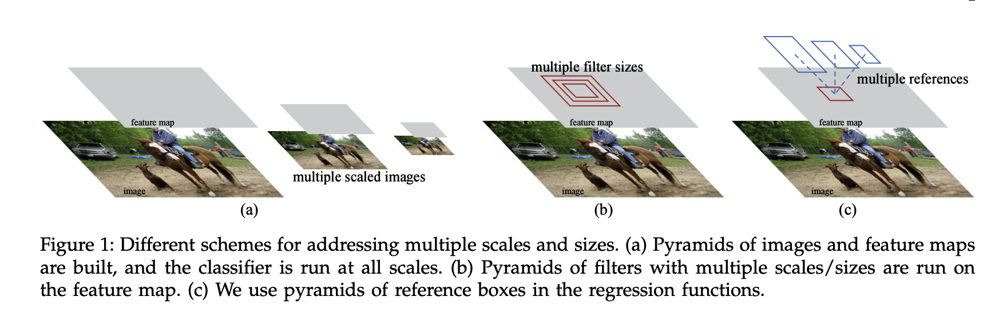
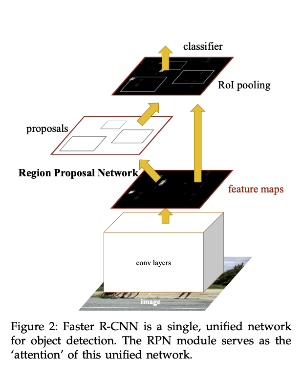

#  Faster R-CNN:Towards Real-Time Object Detection with Region Proposal Networks

> RPN:region proposal  network 区域建议网络 

## Introduction

Although region-based CNNs were computationally expensive as originally developed in [5], their cost has been drastically reduced thanks to sharing convolutions 

尽管基于区域的神经网络在计算上比最初在[5]中开发的要昂贵，但由<u>于共享卷积</u>，它们的成本已经大大降低

Fast R-CNN [2], achieves near real-time rates using very deep networks [3], when ignoring the time spent on region proposals. Now, proposals are the test-time computational bottleneck in state-of-the-art detection systems

Fast R-CNN[2]，使用非常深的网络[3]实现了接近实时的速率，而忽略了在区域提案上花费的时间。现在，<u>proposals是最先进检测系统的测试时间计算瓶颈</u>

Region proposal methods typically rely on inexpensive features and economical inference schemes

区域建议方法通常依赖于廉价的特征和经济的推理方案

Selective Search [4], one of the most popular methods, greedily merges superpixels based on engineered low-level features

选择性搜索[4]是最流行的方法之一，它基于设计的低级特征贪婪地合并超级像素

An obvious way to accelerate proposal computation is to reimplement it for the GPU 

基于CNN的深度学习建议推广到GPU来加快proposal的计算

. This may be an effective engineering solution, but re-implementation ignores the down-stream detection network and therefore misses important opportunities for sharing computation.

这可能是一种有效的工程解决方案，但重新实现忽略了下游检测网络，因此错过了共享计算的重要机会。

In this paper, we show that an algorithmic change— computing proposals with a deep convolutional neural network—leads to an elegant and effective solution where proposal computation is nearly cost-free given the detection network’s computation

在本文中，我们证明了一种使用深度卷积神经网络的算法变化计算建议可以产生一种优雅而有效的解决方案，其中，在给定检测网络的计算的情况下，proposal计算几乎是无成本的

Our observation is that the convolutional feature maps used by region-based detectors, like Fast RCNN, can also be used for generating region proposals

我们的观察结果是，基于区域的检测器（如Fast RCNN）使用的卷积特征图也可以用于生成区域建议

On top of these convolutional features, we construct an RPN by adding a few additional convolutional layers that simultaneously regress region bounds and objectness scores at each location on a regular grid.

方法：在这些卷积特征的基础上，我们通过添加几个额外的卷积层来构建RPN，这些卷积层同时做回归<u>规则网格上每个位置的区域边界</u>和<u>对象性得分</u>。

RPNs are designed to efficiently predict region proposals with a wide range of scales and aspect ratios. In contrast to prevalent methods，that use  pyramids of images (Figure 1, a) or pyramids of filters (Figure 1, b), we introduce novel “anchor” boxes that serve as references at multiple scales and aspect ratios. 

RPN旨在有效预测具有广泛规模和纵横比的区域方案。与使用图像金字塔（图1，a）或过滤器金字塔（图2，b）的流行方法不同，我们引入了新的“锚”框，以多种比例和纵横比作为参考。

<u>**Our scheme can be thought of as a pyramid of regression references (Figure 1, c), which avoids enumerating images or filters of multiple scales or aspect ratios. This model performs well when trained and tested using single-scale images and thus benefits running speed**</u> 

我们的方案可以被认为是回归参考的金字塔（图1，c），它避免了枚举多个尺度或纵横比的图像或过滤器。当使用单尺度图像进行训练和测试时，该模型表现良好，从而提高了运行速度

Meanwhile, our method waives nearly all computational burdens of Selective Search at test-time—the effective running time for proposals is just 10 milliseconds. 

 同时，我们的方法在测试时几乎免除了选择性搜索的所有计算负担，提案的有效运行时间仅为10毫秒。

## RELATED WORK

### Object Proposals 

目标建议

Widely used object proposal methods include those based on grouping super-pixels (e.g., Selective Search [4], CPMC [22], MCG [23]) and those based on sliding windows (e.g., objectness in windows [24], EdgeBoxes [6])

广泛使用的对象建议方法包括基于分组超像素的方法（例如，选择性搜索[4]、CPMC[22]、MCG[23]）和基于滑动窗口的方法（如，窗口中的对象性[24]、边缘盒[6]）

### Deep Networks for Object Detection

R-CNN mainly plays as a classifier, and it does not predict object bounds (except for refining by bounding box regression). Its accuracy depends on the performance of <u>the region proposal module</u> 

R-CNN主要用作分类器，它不预测对象边界（通过边界框回归进行细化除外）。其准确性取决于<u>区域提案模块的性能</u>

In the **OverFeat** method [9], a fully-connected layer is trained to predict the box coordinates for the localization task that assumes a single object. The fully-connected layer is then turned into a convolutional layer for detecting multiple class-specific objects .

在OverFeat方法[9]中，训练<u>完全连接（Fully connected ）</u>的层以预测假设单个对象的定位任务的框坐标。然后将完全连接的层转换为卷积层，用于检测多个类特定对象。

 

The **MultiBox** methods [26], [27] generate region proposals from a network whose last fully-connected layer simultaneously predicts multiple class-agnostic boxes, generalizing the “singlebox” fashion of OverFeat.

MultiBox方法[26]，[27]从网络生成区域建议，该网络的最后一个完全连接的层同时预测多个类不可知的框，概括了OverFeat的“单框”方式。

Shared computation of convolutions [9], [1], [29], [7], [2] has been attracting increasing attention for efficient, yet accurate, visual recognition.

卷积的共享计算[9]，[1]，[29]，[7]，[2]对于高效但准确的视觉识别已经引起了越来越多的关注。

## FASTER-RCNN

Our object detection system, called Faster R-CNN, is composed of two modules. The first module is a deep fully convolutional network that proposes regions, and the second module is the Fast R-CNN detector [2] that uses the proposed regions.

我们的物体检测系统叫做Faster R-CNN由两个模块组成。第一个模块是
提出区域的全卷积网络，第二模块是快速R-CNN检测器[2].使用建议的区域。

faster r-cnn是单通道统一的网络，rpn作为同一网络的attention

the RPN module tells the Fast R-CNN module where to look.

RPN模块告诉网络应该去看哪一部分的区域

### Region Proposal Networks

A Region Proposal Network (RPN) takes an image (of any size) as input and outputs a set of rectangular object proposals, each with an objectness score

区域建议网络（RPN）将图像（任何大小）作为输入，并输出一组矩形对象建议，每个建议都有一个对象得分

Because our ultimate goal is to share computation with a Fast R-CNN object detection network [2], we assume that both nets share a common set of convolutional layers

因为我们的最终目标是与快速R-CNN对象检测网络共享计算[2]，我们假设两个网络共享一组共同的卷积层

To generate region proposals, we slide a small network over the convolutional feature map output by the last shared convolutional layer. 

为了生成区域建议，我们在最后一个共享卷积层输出的卷积特征图上滑动一个小网络。

 <u>**This small network takes as input an `n × n` spatial window of the input convolutional feature map.**</u> 

这个小网络将输入卷积特征图的“n×n”空间窗口作为输入。

Each sliding window is mapped to a lower-dimensional feature (256-d for ZF and 512-d for VGG, with ReLU [33] following).

This feature is fed into two sibling fullyconnected layers—a box-regression layer (reg) and a box-classification layer (cls). 

这个特性被输入到两个兄弟完全连接的层中——一个box回归层（reg）和一个box分类层（cls）。

#### Anchors

At each sliding-window location, we simultaneously predict multiple region proposals, where the number of maximum possible proposals for each location is denoted as k

在每个滑动窗口位置，我们同时预测多个区域建议，其中每个位置的最大可能建议数表示为k

. An anchor is centered at the sliding window in question, and is associated with a scale and aspect ratio 

。锚定位于所讨论的滑动窗口的中心.并且与比例和纵横比相关联

#### Translation-Invariant Anchors

平移不变anchors 

As a comparison, the MultiBox method [27] uses k-means to generate 800 anchors, which are not translation invariant. So <u>MultiBox does not guarantee that the same proposal is generated if an object is translated.</u>

作为比较，MultiBox方法[27]使用k均值来生成800个锚，
它们不是平移不变的。因此，MultiBox不能保证在翻译对象时生成相同的建议。

The translation-invariant property also reduces the model size. 

减小模型的大小

#### Multi-Scale Anchors as Regressioin References 

多尺度锚框作为回归参考

there have been two popular ways for multi-scale predictions. 

- The first way is based on image/feature pyramids, e.g., in DPM [8] and CNNbased methods [9], [1], [2]

  基于图像或特征金字塔

- The second way is to use sliding windows of multiple scales (and/or aspect ratios) on the feature maps. 

  第二种方法是在特征地图上使用多个比例（和/或纵横比）的滑动窗口。

As a comparison, our anchor-based method is built on a pyramid of anchors, which is more cost-efficient.

作为比较，我们的基于锚的方法建立在锚的金字塔上，这更具成本效益。

Because of this multi-scale design based on anchors, we can simply use the convolutional features computed on a single-scale image, as is also done by the Fast R-CNN detector [2]. The design of multiscale anchors is a key component for sharing features without extra cost for addressing scales.

由于这种基于锚的多尺度设计，我们可以简单地使用在单尺度图像上计算的卷积特征，正如Fast R-CNN检测器[2]所做的那样。多尺度锚的设计是共享特征的关键组成部分，而无需额外的尺度寻址成本。

#### Loss Function

训练FPNs，指代两种情况的anchor box为positive label

(i) the anchor/anchors with the highest Intersection-overUnion (IoU) overlap with a ground-truth box, or 具有最高联合交叉点（IoU）的锚与地面实况框重叠

(ii) an anchor that has an IoU overlap higher than 0.7 with any ground-truth box. 

与任何地面真值框具有高于0.7的IoU重叠的锚。

. Note that a single ground-truth box may assign positive labels to multiple anchors.

单个ground truth box可能会被指派多个positive label

#### Training RPNs

The RPN can be trained end-to-end by backpropagation and stochastic gradient descent

反向傳播+隨機梯度下降

We randomly initialize all new layers by drawing weights from a zero-mean Gaussian distribution with standard deviation 0.01

我们通过从具有标准差0.01的零均值高斯分布中提取权重来随机初始化所有新层

### Sharing Features for RPN and Fast R-CNN

Both RPN and Fast R-CNN, trained independently, will modify their convolutional layers in different ways. We therefore need to develop a technique that allows for sharing convolutional layers between the two networks, rather than learning two separate networks. We discuss three ways for training networks with features shared:

> 独立训练的RPN和Fast R-CNN都将以不同的方式修改其卷积层。因此，我们需要开发一种技术，允许在两个网络之间共享卷积层，而不是学习两个独立的网络。我们讨论了三种具有共享功能的培训网络方式：

介紹3種共享特徵的網絡訓練方法

- **Alternating training 交替訓練**

  In this solution, we first train RPN, and use the proposals to train Fast R-CNN. The network tuned by Fast R-CNN is then used to initialize RPN, and this process is iterated. This is the solution that is used in all experiments in this paper

  在這個解決方案中，我們首先訓練RPN，並使用這些建議來培訓Fast R-CNN。
  然後使用Fast R-CNN調諧的網絡，初始化RPN並重複該過程。

- **Approximate joint training 近似聯合訓練**

  In this solution, the RPN and Fast R-CNN networks are merged into one network during training as in Figure 2. In each SGD iteration, the forward pass generates region proposals which are treated just like fixed, pre-computed proposals when training a Fast R-CNN detector. The backward propagation takes place as usual, where for the shared layers the backward propagated signals from both the RPN loss and the Fast R-CNN loss are combined. This solution is easy to implement. <u>But this solution ignores the derivative w.r.t. the proposal boxes’ coordinates that are also network responses, so is approximate.</u> In our experiments, we have empirically found this solver produces close results, yet reduces the training time by about 25-50% comparing with alternating training. This solver is included in our released Python code.

  在該解決方案中，RPN和Fast R-CNN網絡在訓練期間合併為一個網絡，如圖2所示。 在每個SGD反覆運算中，前向通過生成區域建議，當訓練快速R-CNN檢測器時，這些建議與固定的、預先計算的建議一樣被處理。 反向傳播照常進行，其中對於共亯層，來自RPN損耗和快速R-CNN損耗的反向傳播訊號被組合。 <u>此解決方案易於實施。 但該解決方案忽略了提案框座標的導數，該座標也是網絡響應，囙此是近似</u>的。 在我們的實驗中，我們根據經驗發現，該求解器產生了接近的結果，但與交替訓練相比，訓練時間减少了約25-50%。 這個解算器包含在我們發佈的Python程式碼中。

  

- **Non-approximate joint training 非近似聯合訓練**

  As discussed above, the bounding boxes predicted by RPN are also functions of the input. The RoI pooling layer [2] in Fast R-CNN accepts the convolutional features and also the predicted bounding boxes as input, so a theoretically valid backpropagation solver should also involve gradients w.r.t. the box coordinates. These gradients are ignored in the above approximate joint training. In a non-approximate joint training solution, we need an RoI pooling layer that is differentiable w.r.t. the box coordinates. This is a nontrivial problem and a solution can be given by an “RoI warping” layer as developed in [15], which is beyond the scope of this paper

  如上所述，RPN預測的邊界框也是輸入的函數。 Fast R-CNN中的RoI池化層[2]接受卷積特徵以及預測的邊界框作為輸入，囙此理論上有效的反向傳播解算器還應包括相對於框座標的梯度。 在上述近似關節訓練中，忽略了這些梯度。 在一個非近似聯合訓練解決方案中，我們需要一個RoI池層，該層相對於框座標是可微的。 這是一個非平凡的問題，可以通過[15]中開發的“RoI翹曲”層給出解決方案，這超出了本文的範圍

4-step Alternating Training 

In this paper, we adopt a pragmatic 4-step training algorithm to learn shared features via alternating optimization.

 <u>In the first step,</u> we train the RPN as described in Section 3.1.3. This network is initialized with an ImageNet-pre-trained model and fine-tuned end-to-end for the region proposal task. 

<u>In the second step, w</u>e train a separate detection network by Fast R-CNN using the proposals generated by the step-1 RPN. This detection network is also initialized by the ImageNet-pre-trained model. At this point the two networks do not share convolutional layers.

 <u>In the third step</u>, we use the detector network to initialize RPN training, but we fix the shared convolutional layers and only fine-tune the layers unique to RPN. Now the two networks share convolutional layers.

 <u>Finally, keeping the s</u>hared convolutional layers fixed, we fine-tune the unique layers of Fast R-CNN. As such, both networks share the same convolutional layers and form a unified network. A similar alternating training can be run for more iterations, but we have observed negligible improvements.

在本文中，我們採用實用的 4 步訓練算法通過交替優化來學習共享特徵。

 <u>在第一步中</u>，我們按照第 3.1.3 節中的描述訓練 RPN。 該網絡使用 ImageNet 預訓練模型進行初始化，並針對區域建議任務進行端到端微調。 

<u>在第二步中，</u>我們使用步驟 1 RPN 生成的建議通過 Fast R-CNN 訓練一個單獨的檢測網絡。 該檢測網絡也由 ImageNet 預訓練模型初始化。 此時兩個網絡不共享卷積層。

 <u>在第三步中</u>，我們使用檢測器網絡來初始化 RPN 訓練，但是我們固定了共享的捲積層，只微調了 RPN 特有的層。 現在兩個網絡共享卷積層。

 <u>最後，在保持共享卷積層不</u>變的情況下，我們微調了 Fast R-CNN 的獨特層。 因此，兩個網絡共享相同的捲積層並形成一個統一的網絡。 類似的交替訓練可以運行更多次迭代，但我們觀察到的改進微乎其微。

### Implementation Details

NMS does not harm the number of proposals 

NMS不影響檢測，但是逐步減少區域建議

## EXPERIMENTS

pass 

## CONCLUSION

By sharing convolutional features with the down stream detection network ,the region proposal step is nearly cost-free .

通過與下游檢測網絡共享卷積特徵，區域提議步驟幾乎沒有成本

## 實現代碼

https://towardsdatascience.com/understanding-and-implementing-faster-r-cnn-a-step-by-step-guide-11acfff216b0
