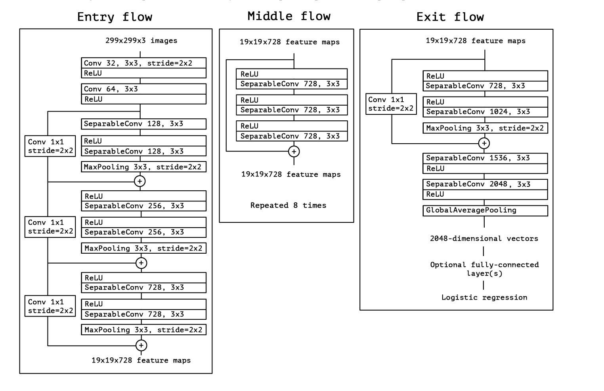

[toc]


# Xception论文记录和代码复现


## Abstract

<u>Inception 模块</u>和<u>深度可分离卷积操作</u>在卷积神经网络中作为常规卷积之间的中间步骤。

從這個角度來看，深度可分離卷積可以理解為具有最大塔數的Inception modules。


X ception 和Inception V3有相同的参数


## Introduction

深度学习已经是计算机视觉中主要的算法解决方法。

卷积神经网络的历史是从[LeNe](https://zh.d2l.ai/chapter_convolutional-neural-networks/lenet.html)t样式的模型，<u>*which were simple stacks of convolutions for feature extraction and max-pooling operations for spatial sub-sampling*.</u>（它们是用于特征提取的**简单卷积堆栈和用于空间子采样的最大池操作**。）在这种模型中，卷积操作重复多次在maxpooling之间，这样可以允许网络在每个空间尺度上学习更丰富的特征。这也使得网络层数越来越深。

接着在2014年出现了Inception结构。


基本Inception模块的构造有不同的版本。

虽然Inception 模块类似于卷积特征提取器，但是Inception凭借经验用更少的参数学习特征

> What is Separable Convolutional Layer
>
> 
>
> *Separable convolutions consist of first performing a depthwise spatial convolution (which acts on each input channel separately) followed by a pointwise convolution which mixes the resulting output channels.- From Keras Documentation*
>
> 

### The Inception hypothesis 

一层卷积层尝试在3D空间中，使用2个空间维度（宽度和高度）和一个通道维度，因此一个卷积层同时映射**<u>跨通道相关性</u>**和**<u>空间相关性</u>**。


this idea behind the inception module is to make process easier and more efficient by explicitly factoring.(显式因式分解)


in effect,the fundamental hypothesis behind Inception is that cross-channel correlations and spatial correlations are sufficiently decoupled (解耦) that it is preferable not to map them jointly.


### The continuum between convolutions and separable convolutioins

a depthwise separable convolution ,commonly called 'separable convolution' in deep learning framework.

consists in a depthwise convolution, 

**a spatial convolution performed independently over each channel of an input,followed by a <u>pointwise convolution逐点卷积</u>**

在輸入的每個通道上獨立執行空間卷積，然後是<u>逐點卷積</u>


## the Xception architecture

提出以下的假说，跨通道相关性和空间相关性的映射在卷积神经网络的特征图中，是可以完全被解耦的。


xception是一个线性残差连接的深度可分离卷积神经网络。




## Experimental evaluation

### training infrastructure

在数据集上，使用具有同步梯度的数据并行性。


### effect of an intermediate activation after pointwise convolutions

the absence of any non-linearity leads to both faster convergence and better final performance.

非线性的缺席会有更好的效果


# 代码复现

```python
'''ref
1. https://towardsdatascience.com/xception-from-scratch-using-tensorflow-even-better-than-inception-940fb231ced9
2. https://stephan-osterburg.gitbook.io/coding/coding/ml-dl/tensorfow/ch3-xception/training-and-evaluating-xception-model
'''
import tensorflow as tf
from tensorflow.keras.layers import Input,Dense,Conv2D,Add
from tensorflow.keras.layers import SeparableConv2D,ReLU
from tensorflow.keras.layers import BatchNormalization,MaxPool2D
from tensorflow.keras.layers import GlobalAvgPool2D
from tensorflow.keras import Model
import os 


'''creating the Conv-BatchNorm block'''
def conv_bn(x,filters,kernel_size,strides=1):
    x= Conv2D(filters=filters,kernel_size=kernel_size,padding='same',use_bias=False,strides=strides)(x)

    x = BatchNormalization()(x)
    return x 

'''creating the separableConv-BatchNorm block'''
def sep_bn(x,filters,kernel_size,strides=1):
    x = SeparableConv2D(filters=filters,kernel_size=kernel_size,strides=strides,padding='same',use_bias=False)(x)

    x = BatchNormalization()(x)
    return x 


'''function for entry,middle and exit flow'''
def entry_flow(x):
    x = conv_bn(x,filters=32,strides=2,kernel_size=3)
    x = ReLU()(x)

    x = conv_bn(x,filters=64,kernel_size=3,strides=1)
    tensor = ReLU()(x)

    x = sep_bn(tensor,filters=128,kernel_size=3)
    x = ReLU()(x)
    x = sep_bn(x,filters=128,kernel_size=3)
    x = MaxPool2D(pool_size=3,strides=2,padding='same')(x)
    
    # 残差连接
    tensor = conv_bn(tensor,filters=128,kernel_size=1,strides=2)
    x = Add()([tensor,x])

    x= ReLU()(x)
    x = sep_bn(x,filters=256,kernel_size=3)
    x = ReLU()(x)
    x = sep_bn(x,filters=256,kernel_size=3)
    x = MaxPool2D(pool_size=3,strides=2,padding='same')(x)

    tensor = conv_bn(tensor,filters=256,kernel_size=1,strides=2)
    x = Add()([tensor,x])

    x = ReLU()(x)
    x = sep_bn(x,filters=728,kernel_size=3)
    x = ReLU()(x)
    x = sep_bn(x,filters=728,kernel_size=3)
    x = MaxPool2D(pool_size=3,strides=2)
    tensor = conv_bn(tensor,filters=758,kernel_size=1,strides=2)
    x = Add()([tensor,x])
    return x 

def entry_flow_v2(x):
    x = conv_bn(x, filters =32, kernel_size =3, strides=2)
    x = ReLU()(x)
    x = conv_bn(x, filters =64, kernel_size =3, strides=1)
    tensor = ReLU()(x)
    
    x = sep_bn(tensor, filters = 128, kernel_size =3)
    x = ReLU()(x)
    x = sep_bn(x, filters = 128, kernel_size =3)
    x = MaxPool2D(pool_size=3, strides=2, padding = 'same')(x)
    
    tensor = conv_bn(tensor, filters=128, kernel_size = 1,strides=2)
    x = Add()([tensor,x])
    
    x = ReLU()(x)
    x = sep_bn(x, filters =256, kernel_size=3)
    x = ReLU()(x)
    x = sep_bn(x, filters =256, kernel_size=3)
    x = MaxPool2D(pool_size=3, strides=2, padding = 'same')(x)
    
    tensor = conv_bn(tensor, filters=256, kernel_size = 1,strides=2)
    x = Add()([tensor,x])
    
    x = ReLU()(x)
    x = sep_bn(x, filters =728, kernel_size=3)
    x = ReLU()(x)
    x = sep_bn(x, filters =728, kernel_size=3)
    x = MaxPool2D(pool_size=3, strides=2, padding = 'same')(x)
    
    tensor = conv_bn(tensor, filters=728, kernel_size = 1,strides=2)
    x = Add()([tensor,x])
    return x 


def middle_flow(tensor):
    # repeat 8 times 
    for _ in range(8):
        x = ReLU()(tensor)
        x = sep_bn(x,filters=758,kernel_size=3)
        x = ReLU()(x)
        x = sep_bn(x,filters=758,kernel_size=3)
        
        x = ReLU()(x)
        x = sep_bn(x,filters=758,kernel_size=3)
        x = ReLU()(x)
        tensor = Add()([tensor,x])
    return tensor 

def middle_flow_v2(tensor):
    for _ in range(8):
        x = ReLU()(tensor)
        x = sep_bn(x, filters = 728, kernel_size = 3)
        x = ReLU()(x)
        x = sep_bn(x, filters = 728, kernel_size = 3)
        x = ReLU()(x)
        x = sep_bn(x, filters = 728, kernel_size = 3)
        x = ReLU()(x)
        tensor = Add()([tensor,x])
        
    return tensor

def exit_flow(tensor):
    x = ReLU(tensor)
    x =sep_bn(x,filters=728,kernel_size=3)
    x = ReLU()(x)
    x =sep_bn(x,filters=1024,kernel_size=3)
    x = MaxPool2D(pool_size=3,strides=2,padding='same')(x)

    tensor = conv_bn(tensor,filters=1024,kernel_size=1,strides=2)
    x = Add()([tensor,x])
    x = sep_bn(x,filters=1536,kernel_size=3)
    x = ReLU()(x)
    x = sep_bn(x,filters=2048,kernel_size=3)
    x = ReLU()(x)
    x = GlobalAvgPool2D()(x)
    x = Dense(units=1000,activation='softmax')(x)
    return x 


def exit_flow_v2(tensor):
    x = ReLU()(tensor)
    x = sep_bn(x, filters = 728,  kernel_size=3)
    x = ReLU()(x)
    x = sep_bn(x, filters = 1024,  kernel_size=3)
    x = MaxPool2D(pool_size = 3, strides = 2, padding ='same')(x)
    
    tensor = conv_bn(tensor, filters =1024, kernel_size=1, strides =2)
    x = Add()([tensor,x])
    
    x = sep_bn(x, filters = 1536,  kernel_size=3)
    x = ReLU()(x)
    x = sep_bn(x, filters = 2048,  kernel_size=3)
    x = GlobalAvgPool2D()(x)
    
    x = Dense (units = 1000, activation = 'softmax')(x)
    
    return x

'''
creating the xception model
'''
def create_model():
    input = Input(shape=(259,259,3))
    x = entry_flow_v2(input)
    x = middle_flow_v2(x)
    output = exit_flow_v2(x)

    model = Model (inputs=input, outputs=output)
    model.summary()


    '''calculate trainable parameters'''
    import tensorflow.keras.backend as K 
    import numpy as np

    sum_parameters = np.sum([K.count_params(p) for p in model.trainanle_weights])
    print(sum_parameters)


'''Image Preprocessing And Augmentation'''
def preprocess_image(x):
    x /=255 
    x-=0.5 
    x*=0.2 
    # convert RGB to BGR
    x = x[...,::-1]
    # Zero-center by mean pixel
    x[..., 0] -= 103.939
    x[..., 1] -= 116.779
    x[..., 2] -= 123.68
    return x

'''train and evaluating Xception Model
'''
def train_xception_model():
    # load the pre-trained xception model 
    models = tf.contrib.keras.models
    layers = tf.contrib.keras.layers 
    uitls = tf.contrib.keras.utils 
    losses = tf.contrib.keras.losses 
    optimizers = tf.contrib.keras.optimizers 
    metrics = tf.contrib.keras.metrics 
    preprocessing_image = tf.contrib.keras.preprocessing.image 
    applications= tf.contrib.kersa.applications 
    

    base_model = applications.Xception(include_top=False,weights='imagenet',input_shape=(299,299,3),pooling='avg')
    # output for convolutional layers
    x = base_model.output 
    # final dense layer 
    outputs = layers.Dense(4,activation='softmax')(x)
    # define model with base_model 
    model = models.Model(inputs=base_model.input,outputs=outputs)
    
    # freeze weights of early layer to ease training 
    for layer in model.layers[:40]:
        layer.trainable=False
    
    loss = losses.categorical_crossentropy
    optimizer = optimizers.RMSprop(lr=0.0001)
    metric = [metrics.categorical_accuracy]
    # compile model
    model.compile(optimizer,loss,metric)
    model.summary()
    
    train_datagen = preprocessing_image.ImageDataGenerator(
                    preprocessing_function=preprocess_image,
                    shear_range=0.2,
                    zoom_range=0.2,
                    horizontal_flip=True)

    test_datagen = preprocessing_image.ImageDataGenerator(
                    preprocessing_function=preprocess_image)
    
    BASE_DIR = "/Users/marvinbertin/Github/marvin/ImageNet_Utils"

    train_generator = train_datagen.flow_from_directory(
        os.path.join(BASE_DIR, "imageNet_dataset/train"),
        target_size=(299, 299),
        batch_size=32,
        class_mode='categorical',
        shuffle=True)

    validation_generator = test_datagen.flow_from_directory(
        os.path.join(BASE_DIR, "imageNet_dataset/validation"),
        target_size=(299, 299),
        batch_size=32,
        class_mode='categorical',
        shuffle=True)

    history = model.fit_generator(
        train_datagen,
        steps_per_epoch = 80,
        epochs=10,
        validation_data = validation_generator,
        validation_steps = 20
    )
        
    print(history.history['accuracy'])


if __name__ =='__main__':
    pass 

```


# 引用

- [Xception:Deep Learning with Depthwise Separable Convolutions](https://arxiv.org/pdf/1610.02357.pdf)

- https://towardsdatascience.com/xception-from-scratch-using-tensorflow-even-better-than-inception-940fb231ced9

- https://stephan-osterburg.gitbook.io/coding/coding/ml-dl/tensorfow/ch3-xception/training-and-evaluating-xception-model
