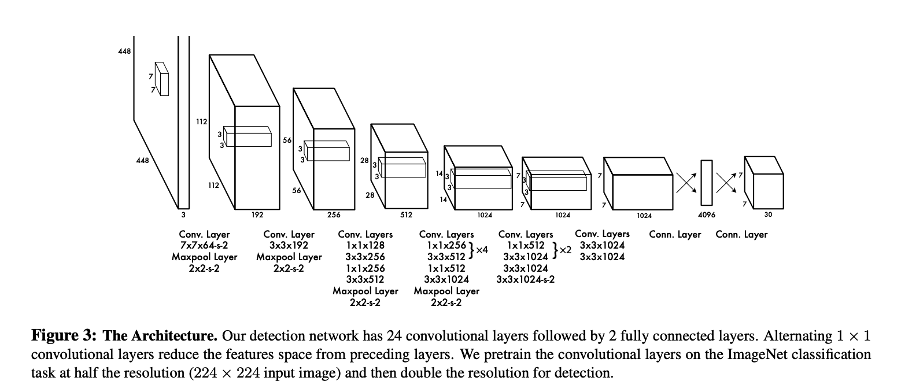

# You Only Look Once,Unified ,Real-Time Object Detection

## Abstract

we frame object detection <u>**as a regression problem to spatially separated bouding boxes and associated probabilities**</u>

作為空間分離的邊界框和相關概率的回歸問題

## 

## Introduction

Current detection systems repurpose classifiers to perform detection.To detect an object, these 

systems take a classifier for that object and **evaluate it at various locations and scales in a test image.** System like <u>deformable parts models</u>(DPM) **use a sliding window approach where the classifier is run at evenly spaced locations over the entire image**

當前的檢測系統重新利用分類器來執行檢測。為了檢測物體，這些系統採用該對象的分類器，並在測試**圖像中的不同位置和尺度上對其進行評估**。 類似<u>可變形部件模型</u>(DPM) 的系統**使用滑動窗口方法，其中分類器在整個圖像上均勻分佈的位置運行。**


其他像R-CNN的（**<u>region proposal</u>**）<u>區域提議方法</u>的實現步驟是

1. first generate potential bounding boxes in an image and then run a classififer on these proposed boxes首先在圖像中生成潛在的邊界框，然後在這些提議的框上運行分類器
2. classification 識別檢測
3. post-processing is used to refine the bouding boxes,eliminate duplicate detections and rescore the boxes based on other objects in the scene.後處理用於細化邊界框，消除重複檢測並根據場景中的其他對像對邊界框重新評分。

總結,these complex pipelines are slow and hard to optimize because each individual component must be trained separately這些複雜的管道很慢且難以優化，因為每個單獨的組件都必須單獨訓練


> hier ist yolo

**we reframe object detection as a single regression problem,straight from pixel to bouding box  coordinates and class probabilities**

我們將目標檢測重新定義為一個單一的回歸問題，直接從像素到邊界框坐標和類別概率


**<u>YOLO的優點概括為</u>**

1. 檢測速度快

   further more,YOLO achieves more than twice the mean average precision of other real-time systems.

   

2. 感受野大

   YOLO reasons globally about the image when making predictions.YOLO 在進行預測時對圖像進行全局推理

   

   YOLO sees the entire image during training and test time so it implicitly encodes contextual information about the classes as well as their appearance.YOLO 在訓練和測試期間看到整個圖像，因此它隱式編碼有關類別及其外觀的上下文信息

   

3. YOLO learns generalizable representations of objects.YOLO 學習對象的概括表示

   


## Unified Detection

> 統一檢測。

我們將目標檢測的獨立組件(separate components)統一到一個神經網絡中。


每个邊界框bounding box包含5个预测`x,y,w,h,`和`confidence`

每个網格單元grid cell还会预测一个`C`,conditional class probabilities條件類概率。`Pr(Class|Object)`

我們只預測每個網格單元的一組類概率，而不管框的數量。


> Our system models detection as a regression problem,I<u>t divides the image into an SxS grid and for each cell predicts *B* bounding boxes,c</u>onfidence for those boxes and *C* class probabilities.These predictions are encoded as an <u>*S*X*S*X(*B*X5+*C*)</u> tensor
>
> `S=7,B=2,C=20`


### Network Design

The initiali convolutional layers of the network extract features from the image while the fully connected layers predict the output probabilities and coordinates.

網絡的初始卷積層從圖像中提取特徵，而全連接層預測輸出概率和坐標。


Our network architecture is inspired by the GoogLeNet model for image classification .<u>Out network has 24 convolutional layers followed by 2 fully connected layers</u>

Instead of the inception modules used by GoogLeNet,we simply use 1x1 reduction layers followed by 3x3 convolutional layers .

我們的網絡架構受到用於圖像分類的 GoogLeNet 模型的啟發。<u>Out 網絡有 24 個卷積層，後面跟著 2 個全連接層</u>

我們沒有使用 GoogLeNet 使用的初始模塊，而是簡單地使用 1x1 縮減層，然後是 3x3 卷積層。





### Training 

adding both convolutional and connected layers to pretrained networks can improve performance.

预训练的权重提升精度


Our final layer predicts both class probabilities and bounding box coordinates,We normalize the bounding box width and height by the image width and height so that they fall between 0 and 1 

归一化边界框


在最后一层是用线性激活函数。`leakly relu`


we optimize for  *sum-squared-error* in the output of our model

使用误差平方和作为optimize


We use sum-squared error because it is easy to optimize, however it does not perfectly align with our goal of maximizing average precision. <u>It weights localization error equally with classification error which may not be ideal.</u> Also, in every image many grid cells do not contain any object. This pushes the “confidence” scores of those cells towards zero, <u>often overpowering the gradient from cells that do contain objects. This can lead to model instability, causing training to diverge early on.</u>

本地权重会导致分类误差，并且使模型在训练早期出现分歧


為了解決這個問題，我們增加了邊界框的損失
協調預測並減少不包含對象的框的置信度預測的損失。 我們
使用兩個參數，λcoord 和 λnoobj 來完成這個。 我們
設置 λcoord = 5 和 λnoobj = .5。

<u>增加bounding box的损失函数，减少predictions的loss</u>


YOLO 預測每個網格單元的多個邊界框。<u>在訓練時，我們只需要一個邊界框預測器對每個對象負責。 我們分配一個預測變量</u>
<u>“負責responsible</u>”預測基於哪個對象prediction 與 ground 的當前 IOU 最高真相。 

這導致邊界框預測器之間的專業化。 每個預測器都能更好地預測特定尺寸、長寬比或對像類別，從而提高整體召回率


請注意，損失函數僅懲罰分類如果對象存在於該網格單元中，則錯誤（因此前面討論的條件類概率）。 如果該預測變量是對地面實況框“負責responsible”（即具有最高該網格單元中任何預測器的 IOU）。


 Our learning rate schedule is as follows: For the first epochs we slowly raise the learning rate from 10−3 to 10−2 . <u>If we start at a high learning rate our model often diverges due to unstable gradients如果我們以高學習率開始，我們的模型通常會因梯度不穩定而發散。.</u> We continue training with 10−2 for 75 epochs, then 10−3 for 30 epochs, and finally 10−4 for 30 epochs. 


我們引入了高達原始圖像大小 20% 的隨機縮放和平移。 我們還在 HSV 顏色空間中將圖像的曝光和飽和度隨機調整了 1.5 倍。


### Inference

the grid design enforces spatial diversity增加空间多样性


### Limitations of YOLO

1. YOLO 對邊界框預測施加了很強的空間約束，<u>因為每個網格單元只能預測兩個框並且只能有一個類別。</u> **這種空間約束限制了我們的模型可以預測的附近物體的數量**。 

   

2. 由於我們的模型學會了預測邊界框數據，<u>它很難泛化到新的或不尋常的對象，寬高比或配置</u>。 我**們的模型還使用相對粗糙的特徵來預測邊界框**，因為我們的架構有多個下採樣層輸入圖像

3. 最後，當我們訓練一個接近檢測性能的損失函數時，我們的損失函數處理錯誤。小邊界框與大邊界框相同盒子。 大盒子中的小錯誤通常是良性的，但小盒子裡的小錯誤對 IOU 的影響要大得多。
   **我們的主要錯誤來源是不正確的本地化。**


## Comparison to Other Detection Systems

检测图片方式大多是滑动窗口，或者是区域子集


**Deformable parts models** 

DPM uses a disjoint pipeline to extract static features,classify regions ,predict bouding boxes for high scoring,DPM 使用不相交的管道來提取靜態特徵，對區域進行分類，預測邊界框以獲得高置信度，


YOLO取代了所有這些不同的部分，使用單個卷積神經網絡。 網絡同時執行特徵提取、邊界框預測、非最大抑制和上下文推理。 網絡不是靜態特徵，而是在線訓練特徵並針對檢測任務優化它們。 我們的
統一架構帶來更快、更準確的模型


**R-CNN**

R-CNN 及其變體使用區域建議而不是滑動窗口來查找圖像中的對象。 选择性搜索 生成潛在的邊界框，卷積網絡提取特徵，SVM 對框進行評分，一個線性模型調整邊界框，非最大抑制消除重複檢測。 這個每個階段。複雜的管道必須獨立精確調整，結果系統非常慢。


YOLO與 R-CNN 有一些相似之處。 每格單元格提出潛在的邊界框並對其進行評分。使用卷積特徵的框。 然而，我們的系統對網格單元提案施加空間限制，有助於減輕對同一對象的多次檢測。


**Other Fast Detectors**

Fast and Faster R-CNN 專注於通過共享計算和使用神經網絡代替提議區域,而不是選擇性搜索。來加速 R-CNN 框架。


**Deep MultiBox**

 MultiBox can also perform single object detection by replacing the confidence prediction with a single class prediction. However, MultiBox cannot perform general object detection and is still just a piece in a larger detection pipeline, requiring further image patch classification. Both YOLO and MultiBox use a convolutional network to predict bounding boxes in an image but YOLO is a complete detection system.

MultiBox還可以通過替換置信度來執行單個對象檢測
使用單類預測進行預測。 然而，MultiBox 不能執行一般的對象檢測，仍然只是
更大的檢測管道中的一塊，需要進一步的圖像塊分類。 YOLO 和 MultiBox 都使用了
卷積網絡來預測圖像中的邊界框，但 YOLO 是一個完整的檢測系統。

**OverFeat**

OverFeat efficiently performs sliding window detection but it is still a disjoint system

OverFeat 有效地執行滑動窗口檢測，但它仍然是一個不相交的系統


**MutliGrasp**

MultiGrasp only needs to predict a single graspable region for an image containing one object. It doesn’t have to estimate the size, location, or boundaries of the object or predict it’s class,MultiGrasp只需要預測包含圖像的單個可抓取區域一個對象。 它不必估計大小、位置、或對象的邊界或預測它的類別。


## 实现代码

https://www.maskaravivek.com/post/yolov1/

數據集下載

```
!wget http://host.robots.ox.ac.uk/pascal/VOC/voc2007/VOCtrainval_06-Nov-2007.tar
!wget http://host.robots.ox.ac.uk/pascal/VOC/voc2007/VOCtest_06-Nov-2007.tar

!tar xvf VOCtrainval_06-Nov-2007.tar
!tar xvf VOCtest_06-Nov-2007.tar

!rm VOCtrainval_06-Nov-2007.tar
!rm VOCtest_06-Nov-2007.tar
```

> 使用google colab运行


