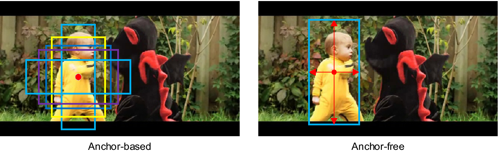
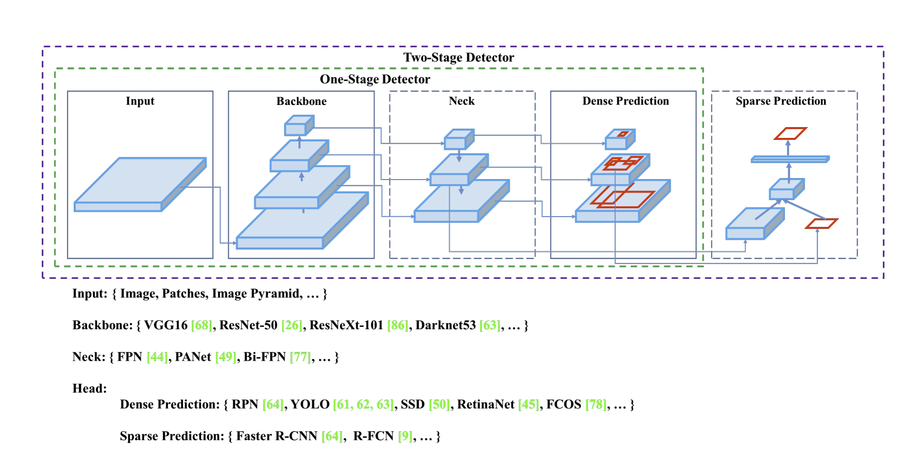

# YOLOv4:Optimal Speed and Accuracy of Object Detection

## Abstract 

~~we assume that such universal features include Weighted-Residual-Connections(WRC).Cross-Stage-Partial-connections (CSP),~~

## Introduction

the majority of CNN-based object detectors are largely applicable only for recommendation systems

基於CNN的目標檢測很大程度上取決了操作系統。

Improving the real-time object detector accuracy enables using them not only for hint generating recommendation systems,but also for stand-alone process management and human input reduction

通過改進實時對象檢測器，不僅可以將其用於生成推薦系統，還可以用於獨立的過程管理和減少人工輸入。

The most accurate modern neural networks do not operate in real time and require large number of GPUs for training with a large mini-batch-size 

最精確的現代神經網路不能實时運行，並且需要大量GPU來進行大規模的小批量訓練

The main goal of this work is <u>**designing a fast operating speed of an object detector in production systems and optimization for parallel compuations**</u>

設計生產系統中物體監測器的快速運行速度並優化並行計算，而不是低體積的理論指標。

## Related work

### Object detection models

a modern detector is usually composed of two parts,a backbone which is pre-trained on ImageNet and a head which is used to predict classes and bounding boxes of objects 

現代目標檢測分為倆個步驟1⃣️backbone預訓練模型2⃣️head預測類別概率

關於head的部分有

- one-stage object detector單通道檢測器

  > yolo,ssd

- two-stage object detector雙通道檢測器 

  > R-CNN series

It is also possible to make a two-stage object detector an anchor-free object detector 

雙通道也能發展成anchor-free

> 

Object detectors developed in recent years often insert some layers between backbone and head,and these layers are usually used to collect feature maps from different stages.

神經網絡通過增加網絡層數來手機不同角度的特徵。

we can call it the neck of the an object detector

我們將這個稱為網絡的頸部

Usually,a neck is composed of serveral bottom-up paths and serveral top-down paths

目標檢測的頸部通常有自下而上，或自上而下的路徑組成。

To sum up,an ordinary object detector is composed of serval parts

**<u>總計來說，目標檢測由以下組成</u>**

- **Input:**Image,Patches,Image Pyramid

- **Backbone:**(VGG16,ResNet-50,SpineNet)(gpu platform),EfficientNet-B0/B7,CSPResNeXt50,CSPDarkNet53

- **Neck:**

  *collect features map from different stages從不同階段收集特徵圖*

  - **Additional blocks:**SPP,ASPP,RFB,SAM
  - **Path-aggregation blocks:**PPN,PAN,NAS-FPN,Fully-connected FPN,BiFPN,ASFF,SFAM

- **Heads:**

  - **Dense Prediction(one-stage):**
    - RPN,SSD,YOLO,RetinaNet(anchor based)
    - CornetNet,CenterNet,MatrixNet,FCOS,(anchor free)
  - **Sparse Prediction(two-stage):**
    - Faster R-CNN,R-FCN,Mask R-CNN(anchor based)
    - RepPoints(anchor free)

### Bag of freebies

> usually  a convolutional object detector is trained offline.Therefore,researchers always like to take this advantage and <u>develop receive better accuracy without increasing the inference cost</u>使用更好的訓練方法而不增加推理成本

<u>**we can call these methods that only change the training strategy or only increase the training cost as 'bag of freebies'**</u>

這種只改變訓練策略，或者增加訓練成本的方法，稱呼為bag of freebies免費包

what is often adopted by object detection methods and meets the definition of bag of freebies is data augmentation.

对象检测方法经常采用的并且符合freebies包定义的是数据增强。

The purpose of data augmentation is to increase the variablity of the input images ,so that the designed object detection model has higher robustness to the images obtained from different enviroments

數據增強的目標是在不同環境下，模型有更高的魯棒性。

photometric distoritions ,geometric distoritions 

常見的數據增強方法有photometric distoritions光度失真 ,geometric distoritions幾何失真

the data augmentation methods mentioned above are all <u>pixel-wise adjustments</u> .逐像素調整

>  in addition,some researchers engaged in data augmentation put their emphasis on simulating object occlusion issues.將重點放在模擬對象遮擋的發布者上

>  in addition to above mentioned methods,style transfer GAN is also used for data augmentation,and such usuages can effectively reduce the texture bias learned by CNN甚至用GAN 產生的圖片來訓練CNN

Different from the various approaches proposed above,some other bag of freebies methods are dedicated to solving the problem that the semantic distribution in the datase may have bias 

致力解決數據集中語義分佈存在偏差的問題，

 

In dealing with the problem of semantic distribution bias,a very important issue is that there is a problem of data imbalance between different classessm,and this problem is often solved by hard negative example mining or online hard example mining in two-stage object detector 

不同類之間存在數據不平衡的問題，這一問題通常通過雙通道檢測中的硬否定示例挖掘或在線硬示例挖掘解決。

。。。。

### Bag of specials

for those plugin modules and post-processing methods that **<u>only increase the inference cost by a small amount but can signifficantly improve the accuracy of object detection.</u>**we can call them 'bag of specials'

增加小部分的推理時間，但明顯增加模型精度的預處理方法

Generally speaking these plugin modules are for enhancing certain attributes in these plugin modules are for enhancing certain attributes in a model ,such as <u>enlarging receptive field,introducing attention mechasim,or strengthening feature intergration catpability</u> 

常見的方法有增大感受嘢，注意力機制等

#### receptive field 

common modules that can be used to enhance receptive filed are SPP,ASPP,and RFB

擴大感受野的方法有SPP,ASPP,RFB 

The SPP modul was originated from Spatial Pyramid Matching(SPM)

SPP模块源自空间金字塔匹配（SPM）

> SPMs original method was to split feature map into serval `dxd` equal blocks,where `d` can be {1,2,3}
>
> ,thus forming spatial pyramid,and then extracting bag of word features.
>
> SPP intergrates SPM into CNN and use max-pooling operation instead of bag-of-word-operation
>
> SPM最初的方法是将特征图分割成几个“dxd”相等的块，其中“d”可以是{1,2,3}从而形成空间金字塔，然后提取单词特征包。SPP将SPM集成到CNN中，并使用最大池操作而不是单词包操作

Since the SPP module proposed by... will output one dimensional feature vector 

SPP模塊輸出一維特鎮向量。

Under a design,a relatively large `kxk` max-pooling effectively increase the receptive field of backbone feature 

在设计中，相对较大的“kxk”最大池有效地增加了主干特征的感受野

> the difference in operation between ASPP module and improved SPP module is mainly from the original `kxk` kernel size,max-pooling of stride equals to 1 to several  3x3 kernel size .

#### attention

The attention module that is often used in object detection is mainly divided into <u>channel-wise attention and point-wise attention</u>.

In terms of feature intergration,the early practice is use <u>skip connection</u> or <u>hyper-column t</u>o intergrate low-level physical feature to high-level semantic feature

在特征集成方面，早期的实践是使用<u>跳过连接</u>或<u>超列t</u>将低级物理特征集成到高级语义特征

#### activation function

in the research of deep learning ,some people put their focus on searching for good activation function.

in 2010,Nair and hinton propose <u>ReLU to substantially solve the gradient vanish problem which is frequently encountered in traditional tanh and sigmoid activation</u> function2010年，Nair和hinton提出了ReLU，以实质上解决传统tanh和sigmoid激活函数中经常遇到的梯度消失问题

**LReLU** and **PReLU i**s to solve the problem that the gradient of ReLU is zero when the ouput is less than zero

#### NMS 

the post-processing method commonly used in deep learning-based object detection is NMS,which can be used to filter those BBoxes,that badly predict the same object and only retain the candidate BBoxes with higher response.在基于深度学习的对象检测中通常使用的后处理方法是NMS，它可以用于过滤那些预测相同对象的BBox，并且只保留具有较高响应的候选BBox。

The NMS tries to improve is consistent with the method of optimizing an objective function

NMS试图改进与优化目标函数的方法一致

## Methodology 

### Selection of architecture 

Our objective is to find the optimal balance among the input network resolution, the convolutional layer number, the parameter number (filter size2 * filters * channel / groups), and the number of layer outputs (filters). 

找到輸入網絡分辨率，卷積層數，參數和層輸出數之間的最佳平衡

The next objective is to select additional blocks for increasing the receptive field and the best method of parameter aggregation from different backbone levels for different detector levels:

從不同backbone水平為不同的檢測器水平選擇額外的句塊來增加接受填充和參數聚集的最佳方式

A reference model which is optimal for classification is not always optimal for a detector. In contrast to the classifier, the detector requires the following:

最佳分類參攷模型為
對於檢測器來說並不總是最佳的。 與分類器不同，檢測器需要以下各項：

- Higher input network size(resolution ) -- for detecting multiple small-size objects 

  更高的輸入網絡大小（分辯率）--用於檢測多個小尺寸對象

  

- More layers -- for a higher receptive field to cover the increased size of input network

  更深層數

  

- More parameters -- for greater capacity of a model to detect multiple objects of different sizes in a single image 

  更多參數

  

  

  

  

The influence of the receptive field with different sizes is summarized as follows:

不同大小的感受野的影響總結如下：

- Up to the object size -- allows viewing the entire object 

  最大對象大小

- Up to network size -- allows viewing the context around the object 

  最大網絡大小

- Exceeding the network size -- increase the number of connections between the image point and the final activation

  超過網絡大小增加圖像點和最終獲得之間的連結數量

  

  

### Selection of BoF and BoS 

For improving the object detecting training ,a CNN usually uses the following :

- Activations:

- Bounding box regression loss:

- Data augmentation:

- Regularization method:

- Normalization of the network activations by their mean and variance

  網絡激活的均值和方差歸一化

- Skip-connections

  

### Additional improvements 

In order to make the designed detector more suitable for training on single GPU,we made a additional design and improvement as follows:

- We introduce a new method of data augmentation Mosaic,and Self-Adversarial Training(SAT)

  數據增強方式：Mosaic和自對抗機制

- we select optimal hyper -parameters while applying genetic algorithms

  應用遺傳算法選擇最優超參數

- we modify some existing methods to make our design suitable for efficient training and detection -modified SAM ,modified PAN,and Cross mini-Batch Normalization

**Mosaic** represents a new data augmentation method that mixes 4 training images,Thus 4 different contexts are mixed .

In addition,batch normalization calculates  activation statistics from 4 different images on each layer,This significantly reduces the need for a largre min-batch-size 

批量標準化從每個層的4個不同圖像中計算激活統計，大大減少了對批量的統計。

**Self-Adversarial Training (SAT) **also represents a new data augmentation technique that operates in 2 forward backward stages. In the 1st stage the neural network alters the original image instead of the network weights. In this way the neural network executes an adversarial attack on itself, altering the original image to create the deception that there is no desired object on the image. In the 2nd stage, the neural network is trained to detect an object on this modified image in the normal way 

1⃣️神經網絡改變原始圖像而不是網路權重，通過這種方式神經網路對自己進行對抗性攻擊，改變原始圖像以製造所有所需對象的假象

2⃣️神經網路被訓練以正常形式檢測修改後的圖像上的對象

### YOLOv4

> 
>
> Backbone:預訓練模型
>
> Neck:從不同階段預測特徵圖
>
> Head:預測類別概率

Backbone：CSPDarknet53

 

Neck：SPP，PAN

Head：YOLOv3

>
>
>YOLO v4 uses: 
>
>- Bag of Freebies (BoF) for <u>backbone:</u> CutMix and Mosaic data augmentation, DropBlock regularization, Class label smoothing 
>- Bag of Specials (BoS) for <u>backbone</u>: Mish activation, Cross-stage partial connections (CSP), Multiinput weighted residual connections (MiWRC) 
>-  Bag of Freebies (BoF) for <u>detector</u>: CIoU-loss, CmBN, DropBlock regularization, Mosaic data augmentation, Self-Adversarial Training, Eliminate grid sensitivity, Using multiple anchors for a single ground truth, Cosine annealing scheduler [52], Optimal hyperparameters, Random training shapes 
>- Bag of Specials (BoS) for <u>detector</u>: Mish activation, SPP-block, SAM-block, PAN path-aggregation block, DIoU-NMS

## Experiments

#### Influence of different features on Classifier training

#### Influence of different features on Detector training

#### Influence of different backbones and pretrained weightings on Detector training 

#### Influence of different mini-batch size on Detector training 

we found that after training BoF and BoS training strategies s,the mini-batch has almost no effect on the detector's performance .

